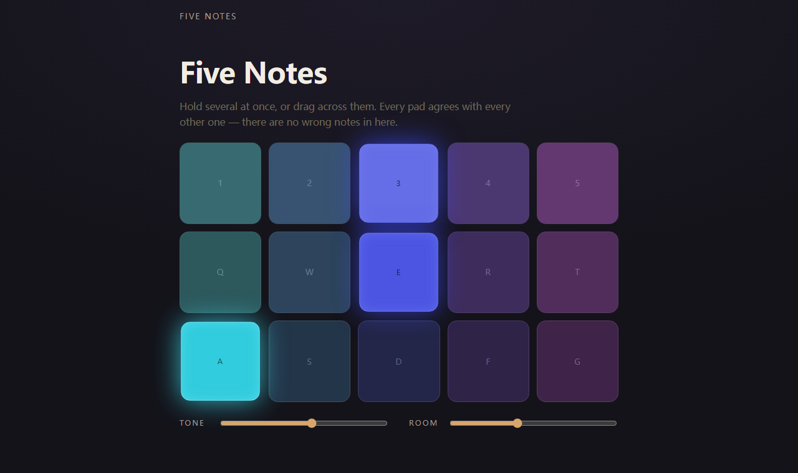

# Process overview

## What I built

**Five Notes** — fifteen pads tuned to one major pentatonic scale across three
octaves, synthesised live in the browser with the Web Audio API. Press, hold,
drag across them, or play the rows from the home row of the keyboard; strike
velocity comes from where on the pad you hit, and two sliders move the whole
instrument's brightness and reverb. The idea is that the spec line "there is no
way to play it wrong" should be a property of the instrument rather than a rule
it enforces on you: pick five notes with no minor second and no tritone between
any pair, and a stranger mashing the grid with a whole hand gets a chord.

## The moments that mattered

### Making "no wrong notes" arithmetic instead of etiquette

The obvious build is a chromatic keyboard plus something that stops you playing
badly — a snap-to-scale, a quantiser, some forgiveness layer. I went the other
way and deleted the wrong notes from the instrument entirely, which meant the
whole guarantee collapsed into one array of five intervals and could be checked
directly. `spec/scale.test.ts` walks every pair of the fifteen pads and asserts
that no two are 1 or 6 semitones apart, so the property is proved over the whole
grid rather than spot-checked. That test is also what stops a later "let's add a
seventh" from quietly reintroducing wrong answers
([`3a4c306`](https://github.com/comp4020-agentic-coding-studio/comp4020-crit4-HHHFFF-HHHFFF/commit/3a4c306)).

The same instinct settled the layering. JSDOM has no Web Audio at all — `new
AudioContext()` throws there — so rather than mock it, the tuning lives in a
module with no DOM and no audio in it, and the synthesis lives in a module with
no DOM. What's left for the browser is the part only a browser can answer.

### A green suite that could not see the bug

The pads were done and every check passed, so the remaining work looked like
polish. Screenshotting the played state next to the idle one showed the grid
sitting 25px lower after the first note: the opening prompt swaps to a longer
line, that line wraps, and everything below it moves — at the exact moment the
crit's pod has made one sound and is deciding whether to make a second.

Both states were correct. Only the transition was wrong, and every assertion in
the repo looks at one state at a time, so re-running the suite would never have
told me. I fixed the CSS
([`e2c35cf`](https://github.com/comp4020-agentic-coding-studio/comp4020-crit4-HHHFFF-HHHFFF/commit/e2c35cf)),
but the fix isn't the interesting part — the blind spot is. So the correction
went into the harness: `pnpm check:render` drives the built page in real Chrome
through the same `window.harness` seam a visitor's gestures reach, and compares
the layout of every element in `<main>` before and after the first sound, at
both marked viewports
([`47a8941`](https://github.com/comp4020-agentic-coding-studio/comp4020-crit4-HHHFFF-HHHFFF/commit/47a8941)).

How I knew it was a real sensor and not decoration: I checked the pre-fix files
back out, rebuilt, and ran it — red at both viewports — then restored HEAD and
ran it again — green. Getting there cost two false positives, both of which
taught me more than the original bug and are now written into `CLAUDE.md`:
`getBoundingClientRect()` includes CSS transforms, and — the one I'd never have
guessed — a transform also makes an element a *containing block*, so lighting a
pad re-parents its child span's `offsetParent` and an entirely unchanged layout
reported a 506px jump. The fix was to sum `offset*` up the `offsetParent` chain
and drop transformed subtrees from the comparison, rather than to wave it
through with a pixel tolerance
([`3a4c306...47a8941`](https://github.com/comp4020-agentic-coding-studio/comp4020-crit4-HHHFFF-HHHFFF/compare/3a4c306...47a8941)).

## What the checks can't tell you

Whether it sounds good. Whether the envelope is too slow to feel like a strike,
whether the reverb is a wash, whether a gesture is expressive or just tiring.
Nothing in `pnpm check` has an opinion on any of it, and the parts I changed by
ear — release length, the near-octave partial at 2.002 that makes a held chord
shimmer instead of sitting still, the master compressor so fifteen held pads
duck rather than clip — left no trace in any test.
